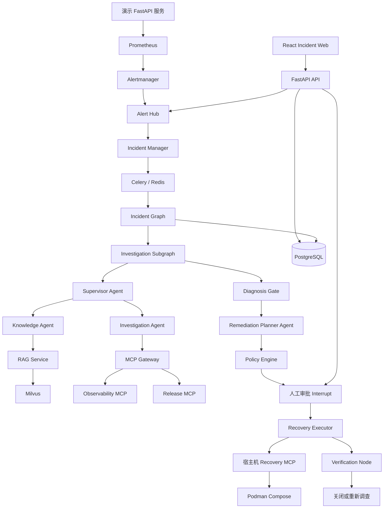

# 智能 OnCall Agent V1 设计方案

**日期：** 2026-07-20

**状态：** 待用户完成书面规格审阅

**项目：** 面向软件服务的智能 OnCall Agent

## 1. 项目目标

构建一个本地运行、具备企业级工程边界的软件智能 OnCall 系统。V1 需要演示一条完整故障闭环：

```text
发布故障版本
→ 产生真实监控告警
→ 统一接收、标准化、去重和聚合告警
→ 多 Agent 调查
→ 从 Milvus 检索 SOP
→ 生成修复计划
→ 人工审批
→ 受控回滚
→ 验证恢复结果
→ 关闭 Incident 并形成审计时间线
```

V1 优先跑通一条完整纵向链路，不追求同时覆盖大量项目和故障类型。首个演示项目只有一种主要故障：发布新版本后 HTTP 错误率显著升高。

## 2. 已确认的产品决策

- 后端：Python + FastAPI。
- 前端：React + TypeScript。
- Agent 框架：LangGraph，配合 LangChain 集成。
- 模型服务：通过 OpenAI-compatible API 对接阿里云百炼。
- 知识检索：Milvus Dense 向量与 BM25 混合检索。
- Agent 架构：外层确定性 Incident Graph，调查阶段由 Supervisor 编排专业 Agent。
- 外部工具：多个窄接口 MCP Server，通过 MCP Gateway 统一接入。
- 容器运行时：Podman + `podman compose`，不依赖 Docker Desktop 或 Docker CLI。
- 故障恢复：宿主机运行 Recovery MCP，执行真实、白名单化的 Podman 回滚。
- 用户认证：本地用户名和密码、JWT、RBAC。
- Web 控制台：Incident 列表页 + 详情标签页。
- 交付策略：V1 先完成业务功能，完整自动化测试和 Agent 评测推迟到 V1.1。
- V1 不实现长期记忆和经验自动沉淀。

## 3. 项目范围

### 3.1 V1 实现范围

- 一个演示 FastAPI 服务，包含健康版本 `v1` 和故障版本 `v2`。
- 一个流量生成器，使版本故障可以被稳定观测。
- Prometheus 指标和 Alertmanager `HighErrorRate` 告警。
- Alert Hub：接收、校验、标准化、去重、聚合告警。
- PostgreSQL 中的 Incident 生命周期数据和 LangGraph Checkpoint。
- 调查阶段的 Supervisor、Investigation Agent、Knowledge Agent。
- 诊断确认后的 Remediation Planner Agent。
- 人工编写、Git 版本化的 Skill。
- 人工导入 Milvus 的 Markdown SOP 和 Runbook。
- Observability MCP、Release MCP、Recovery MCP。
- 确定性的 Policy Engine 和 Recovery Executor。
- 回滚前的人工审批。
- 基于服务状态和 Prometheus 指标的恢复验证。
- React 登录页、Incident 列表、详情标签、审批操作和用户管理。
- 结构化审计事件、JSON 日志、Prometheus 应用指标。

### 3.2 V1 明确不实现

- 用户聊天或对话式 Incident 处理。
- 会话记忆、用户偏好记忆、历史事件记忆、程序记忆。
- 从已解决 Incident 自动抽取经验。
- 自动更新 SOP、Runbook 或 Skill。
- 多租户或多个真实业务项目。
- Kubernetes。
- Kafka。
- 自动修改源代码。
- 未经审批的生产环境写操作。
- 多告警源之间的大模型语义关联。
- 浏览器中的知识上传、审核和发布工作流。
- 完整的单元测试、集成测试、浏览器测试、RAG 评测和 Agent 评测体系。

### 3.3 后续版本

V1.1 建设测试和质量体系，包括：自动化测试、故障回放数据、RAG 检索评测、Agent 评测、MCP 契约测试和浏览器端到端测试。

V2 增加：用户对话、短期和长期记忆、结构化历史事件经验、经验脱敏去重与人工审核，以及经过审核的 SOP 或 Skill 演化。

## 4. 总体架构选型

### 4.1 方案 A：完全自治的 Supervisor

Supervisor 自由决定调用 Agent、工具、审批、执行和验证步骤。

优点：

- 代码量少。
- 行为灵活。
- 容易快速展示多 Agent。

缺点：

- 无法可靠保证调查、审批和验证一定发生。
- Supervisor 可能过早执行修复。
- 执行路径不稳定。
- Checkpoint 恢复和确定性测试困难。

不选择该方案。

### 4.2 方案 B：确定性生命周期 + 受控 Supervisor

外层 LangGraph 控制 Incident 生命周期。只有调查阶段允许 Supervisor 动态协调只读专业 Agent。修复计划、审批、执行和验证都是显式 Graph 节点。

该方案是最终选择，因为它同时提供：

- 灵活的故障调查。
- 可预测的副作用。
- 可暂停和恢复的人工审批。
- 清晰的审计路径。
- 明确的安全边界。

代价是必须提前定义状态和节点接口，但对 OnCall 系统而言这是合理成本。

### 4.3 方案 C：Agent 点对点协作或事件驱动 Agent 集群

每个 Agent 独立部署并直接互相发送任务。

优点：隔离和伸缩能力较强。

缺点：容易形成循环、分布式状态复杂、最终决策责任不明确，对单一 MVP 故障链路过重。

不选择该方案。

## 5. 系统架构



OnCall 后端采用模块化单体，避免 V1 过早微服务化。MCP Server 作为独立进程运行，通过明确的工具契约和平台交互。演示项目只通过告警和 MCP 接口与 OnCall 平台连接。

## 6. 组件职责

### 6.1 FastAPI API

- 接收 Alertmanager Webhook。
- 提供认证、Incident、审批、重试、报告、用户管理和 SSE API。
- 所有命令先持久化，再投递后台任务。
- 不在 HTTP 请求中直接运行长时间 Agent 调查。

### 6.2 Alert Hub

- 验证告警来源和请求格式。
- 保存原始 Webhook。
- 将来源数据转换为统一的 `AlertEnvelope`。
- 校验或生成告警指纹。
- 对重复通知进行去重。
- 应用确定性基础关联规则。
- 将告警关联到已有开放 Incident，或创建新 Incident。
- 管理 `firing` 和 `resolved` 状态。

标准化、身份判定和基础聚合必须使用确定性代码。这些操作要求幂等、低延迟、可回放，而且在模型服务不可用时仍然必须工作。

### 6.3 Incident Manager

- 维护合法的 Incident 状态转换。
- 维护告警和 Incident 的关联关系。
- 生成审计事件。
- 投递幂等的启动或恢复任务。
- 拒绝过期命令和非法状态转换。

### 6.4 Job Worker

- 从 Redis 消费 Celery 任务。
- 启动或恢复 LangGraph。
- 以 PostgreSQL 作为持久化事实来源。
- Graph 到达审批 Interrupt 后结束当前任务，不长期占用 Worker。

### 6.5 RAG Service

- 导入已审核的 Markdown SOP 和 Runbook。
- 先按 Markdown 标题层级切分，再按 Token 长度二次切分。
- 创建 Dense 和 Sparse 表示。
- 按项目、服务、文档类型、版本和审核状态过滤。
- 返回数量受限、带来源和章节引用的检索结果。

### 6.6 Policy Engine

- 执行环境和动作白名单。
- 校验 ActionPlan 哈希和审批状态。
- 校验当前版本和允许回滚的目标版本。
- 拒绝过期或现场条件已变化的计划。
- 将错误分类为可重试、需要人工或终止。

### 6.7 Recovery Executor

- 只接收已经审批的结构化 `ActionSpec`。
- 校验幂等状态和执行前置条件。
- 调用一次 Recovery MCP。
- 调用前后都记录执行状态。
- 执行失败时禁止临时生成新命令。

## 7. 统一告警模型

所有告警来源 Adapter 都必须输出 `AlertEnvelope`：

```json
{
  "source": "alertmanager",
  "project_id": "demo-shop",
  "environment": "staging",
  "service": "order-api",
  "alert_name": "HighErrorRate",
  "severity": "critical",
  "status": "firing",
  "starts_at": "2026-07-20T06:00:00Z",
  "fingerprint": "sha256:...",
  "labels": {},
  "annotations": {}
}
```

指纹规则：

1. 来源提供合法 fingerprint 时优先使用。
2. 否则使用 `project_id`、`environment`、`service`、`alert_name` 和配置的稳定标签计算 SHA-256。
3. 重复通知只更新 `last_seen`、`status` 和 `occurrence_count`，不创建新告警。

V1 的 Incident 聚合条件：项目、环境、服务和配置的 `correlation_key` 相同，并且落在五分钟时间窗口内。

告警变成 `resolved` 只更新告警状态，不能绕过 Verification Node 直接关闭 Incident。

未来语义关联采用混合方案：告警身份和候选分组仍由确定性规则完成；大模型只能建议跨服务合并，不能修改 fingerprint、删除告警或直接关闭 Incident。

## 8. Incident Graph 与多 Agent 编排

外层状态机固定为：

```text
normalize_incident
→ investigate
→ diagnosis_gate
→ create_remediation_plan
→ evaluate_policy
→ wait_for_approval
→ execute_action
→ verify_recovery
→ close_or_reinvestigate
```

### 8.1 Supervisor Agent

- 只在 Investigation Subgraph 中运行。
- 阅读精简后的 Incident 事实和证据摘要。
- 决定调用 Investigation Agent 还是 Knowledge Agent。
- 判断仍缺少哪些证据。
- 向 Diagnosis Gate 提交诊断候选。
- 无权调用 Recovery MCP。
- 无权批准 ActionPlan。

### 8.2 Investigation Agent

- 只使用 Observability MCP 和 Release MCP 的只读工具。
- 输出观察、证据、假设和下一步检查建议。
- Graph State 只保存原始数据引用和摘要，不保存大段原始日志。

### 8.3 Knowledge Agent

- 只使用 RAG 检索工具。
- 返回适用步骤、警告、文档版本和引用。
- 不能把未审核或已失效的文档作为权威依据。

### 8.4 Remediation Planner Agent

- 只有 Diagnosis Gate 接受诊断后才运行。
- 输入包括：选定根因、支持与反对证据、知识引用、当前版本和环境。
- 输出结构化 ActionPlan，包括前置条件、风险、目标版本和验证标准。
- 不拥有任何执行工具。

### 8.5 调查限制

- 最大调查轮数：4。
- 每轮最多调用两个子 Agent。
- 单次日志结果最多100条或20 KB。
- 单次 RAG 最多返回5个 Chunk。
- 每个 Incident 最多调用模型12次。
- 调查时限5分钟，不包含人工审批等待时间。
- 验证失败后最多重新调查一次。

超过限制后，Incident 进入 `NEED_HUMAN` 并记录明确原因。

## 9. 结构化数据契约

Agent 和 Graph 边界使用 Pydantic 模型，不使用无约束自由文本：

- `AlertEnvelope`：标准化告警事实。
- `Evidence`：来源类型、来源引用、查询摘要、观察结果、采集时间。
- `Hypothesis`：根因描述、支持证据、反对证据和下一步检查。
- `KnowledgeCitation`：文档、版本、章节、文件路径和引用位置。
- `ActionPlan`：摘要、风险、前置条件、动作、回滚行为、验证标准。
- `ActionSpec`：工具名称和经过校验的工具参数。
- `VerificationResult`：检查项、观察值、最终结论和原因。

模型输出未通过 Schema 校验时，只允许携带校验错误重试一次。第二次仍失败时停止自动处理并请求人工介入。

## 10. RAG 设计

### 10.1 检索方案选择

方案 A：只使用 Dense 向量检索。

- 优点：实现简单，适合自然语言语义。
- 缺点：对错误码、服务名、指标名和版本号等精确标识符表现不足。

方案 B：Dense + BM25 混合检索。

- 同时覆盖自然语言语义和精确关键词。
- 可以直接在 Milvus 中实现，不额外部署 Elasticsearch。
- 适合同时包含说明文本与技术标识符的运维文档。

方案 C：知识图谱 + 向量检索。

- 适合复杂服务依赖推理。
- 但需要实体抽取、图数据库和关系维护，超出 V1 范围。

V1 选择方案 B，使用 RRF 融合 Dense 与 BM25 结果。

### 10.2 文档数据结构

每个 Chunk 包含：

```text
chunk_id
project_id
document_id
document_type
service
environment
title
section_path
content
source_path
version
review_status
dense_vector
sparse_vector
```

只返回 `review_status=approved` 的文档。V1 只支持 Markdown 知识文件。原始文档和 Skill 保存在 Git 中，Milvus 只是检索索引，不是权威文档存储。

Dense Embedding 通过配置的百炼 OpenAI-compatible Embedding 接口生成。导入和查询必须使用相同模型及相同向量维度，具体模型名通过环境变量配置。

### 10.3 知识导入

使用 CLI 导入：

```bash
python -m oncall.cli knowledge ingest \
  --project demo-shop \
  --path project-packs/demo-shop/knowledge
```

V1 不提供浏览器知识上传，也不允许 Agent 自动写入知识库。

## 11. Skill 设计

### 11.1 Skill 触发方式选择

方案 A：Supervisor 浏览所有 Skill 后自主选择。

- 灵活，但 Skill 增多后上下文持续膨胀。

方案 B：确定性规则一对一触发。

- 稳定，但难以处理同一告警对应多种故障的情况。

方案 C：规则筛选候选 + Supervisor 最终选择。

- 先根据告警名、服务类型和标签筛出最多三个候选 Skill。
- 再由 Supervisor 根据证据选择。

V1 选择方案 C。

### 11.2 Skill 包结构

```text
skills/post_deployment_regression/
├── skill.yaml
├── instructions.md
└── examples/
    └── example.json
```

Manifest 声明：适用告警、服务类型、标签、允许的只读工具、禁止动作、输出 Schema 和版本号。

Skill 只指导调查，不能绕过 Policy，也不能调用 Recovery MCP。

V1 Skill 全部由人工编写并纳入 Git 版本管理。Skill 自动生成或修改属于 V2。

## 12. MCP 设计

### 12.1 MCP 拆分方式选择

方案 A：Agent 直接调用各系统 SDK。

- 会在多个 Agent 中重复认证、超时、截断和审计逻辑。

方案 B：一个大型 MCP Server 提供所有工具。

- 部署简单，但混合只读与写权限，安全边界过大。

方案 C：多个窄接口 MCP Server。

- 按后端和权限拆分。
- 每个接口用途固定、参数强类型。
- 可以独立配置凭证和审计。

V1 选择方案 C，通过 MCP Gateway 统一连接。容器内 MCP 使用 Streamable HTTP。宿主机 Recovery MCP 只监听 loopback；Worker 通过 Podman Machine 的 `host.containers.internal` 网关访问宿主机，启动就绪检查必须验证该连接可用。

### 12.2 Observability MCP

```text
query_metrics
query_service_logs
get_service_health
get_active_alerts
```

### 12.3 Release MCP

```text
get_current_release
get_recent_releases
get_release_diff
```

### 12.4 Recovery MCP

```text
rollback_release
```

Recovery Tool 接收：项目、环境、服务、预期当前版本、目标版本、审批凭证和幂等键。

它禁止接收：命令字符串、任意路径、SQL、Shell 内容或原始 Podman 参数。

MCP Gateway 统一执行 Schema 校验、超时、结果大小限制、服务认证、审计元数据和错误映射。

## 13. Podman 运行环境与真实回滚

### 13.1 容器编排选择

方案 A：直接维护大量 `podman run` 脚本。

- 网络、卷、环境变量和生命周期难以维护。

方案 B：Podman Quadlet。

- 适合 Linux systemd 长期部署。
- 不适合作为 macOS MVP 的主要开发体验。

方案 C：`podman compose`。

- 多容器定义清晰。
- 易于版本管理。
- 能满足本地 MVP。

V1 选择方案 C，使用 `compose.yaml` 和 `Containerfile`，避免依赖 Docker 专属 Compose 扩展。

Podman 管理的主要服务包括：API、Worker、PostgreSQL、Redis、Milvus 及其 Standalone 依赖、Prometheus、Alertmanager、演示服务、流量生成器、前端、Observability MCP 和 Release MCP。

### 13.2 Recovery MCP 的运行位置

把 Podman Socket 挂载进容器，相当于赋予该容器大范围容器控制权限，因此 V1 不这样做。

Recovery MCP 作为宿主机 Python 进程运行：

1. 监听宿主机 loopback。
2. 校验独立服务密钥。
3. 校验项目、服务、当前版本、目标版本、计划哈希和幂等键。
4. 只更新指定演示项目的受控发布状态。
5. 使用内部固定参数列表调用 Podman。
6. 保存执行结果，并提供按幂等键查询状态的能力。

LLM 永远不能传入命令字符串或 Compose 文件路径。

## 14. 用户认证与权限

### 14.1 认证方案选择

方案 A：不做用户认证。

- 无法形成可信审批人记录。

方案 B：直接部署 Keycloak/OIDC。

- 接近企业 SSO，但会给 V1 增加较多基础设施和配置工作。

方案 C：本地密码认证 + JWT + RBAC。

- 能实现真实登录、角色和审批审计。
- 后续可以通过统一认证接口替换为 OIDC。

V1 选择方案 C。

### 14.2 密码与 Token

- 密码使用 Argon2id 哈希。
- Access JWT 有效期15分钟。
- Access Token 只保存在 React 内存。
- Refresh Token 有效期7天。
- Refresh Token 使用不可预测随机值，放在 HttpOnly、SameSite Cookie 中。
- PostgreSQL 只保存 Refresh Token 哈希。
- 刷新时执行 Token Rotation。
- 用户退出或被禁用时撤销 Refresh Token。
- V1 使用环境变量提供的随机 HS256 密钥，因为只有一个 API 签发和验证 Token。

### 14.3 角色

- `viewer`：查看 Incident、证据、计划、引用、报告和审计事件。
- `operator`：拥有 viewer 权限，并可重试或请求重新调查。
- `approver`：拥有 viewer 权限，并可批准或拒绝 ActionPlan。
- `admin`：拥有所有 Web 权限和用户管理权限。V1 知识导入仍是宿主机 CLI 操作。

Approval 必须绑定：`user_id`、`action_plan_id`、`action_plan_hash`、决策、备注和时间。ActionPlan 发生变化后，之前的审批立即失效。

V1 不实现自主注册、邮件验证、找回密码邮件、MFA 和企业 SSO。初始管理员通过 CLI 创建，不把初始密码写入 Compose 文件。

## 15. 数据持久化与后台任务

### 15.1 后台任务方案选择

方案 A：在 Webhook 请求中直接运行 Graph。

- 会长时间阻塞 Alertmanager 请求。

方案 B：FastAPI BackgroundTasks。

- 与 API 进程共享生命周期，重启后无法可靠恢复。

方案 C：Celery + Redis。

- API 和 Worker 分离。
- 支持重试、超时和并发控制。
- 基础设施成本低于 Kafka。

V1 选择方案 C。

PostgreSQL 是持久化事实来源。Redis 只作为 Broker、短期锁和 SSE 实时通知通道。

每个 Graph 启动或恢复任务都必须使用基于 Incident、操作和 Checkpoint 版本生成的幂等键。

Graph 到达人工审批节点后：

1. 将 Checkpoint 写入 PostgreSQL。
2. 当前 Worker 任务正常结束。
3. 用户审批后创建新的 Resume Job。
4. 新 Worker 从 Checkpoint 恢复 Graph。

### 15.2 PostgreSQL 技术选择

方案 A：直接写 SQL。

- 灵活，但模型、迁移和事务代码容易分散。

方案 B：SQLModel。

- 入门简单，但复杂关联最终仍需理解 SQLAlchemy。

方案 C：SQLAlchemy 2 风格模型 + Alembic。

- 适合复杂关联、事务、迁移和审计。
- 数据库模型与 Pydantic API/Agent 模型可以明确分离。

V1 选择方案 C。

核心实体：

```text
users
refresh_tokens
raw_alert_events
alerts
incidents
incident_alerts
evidence
hypotheses
hypothesis_evidence
knowledge_citations
action_plans
action_steps
approvals
executions
verification_checks
audit_events
LangGraph checkpoint tables
```

这些是运行数据，不是记忆系统，也不会自动成为其他 Incident 的学习经验。

## 16. API 边界

认证：

```text
POST /api/v1/auth/login
POST /api/v1/auth/refresh
POST /api/v1/auth/logout
GET  /api/v1/auth/me
```

告警接入：

```text
POST /api/v1/webhooks/alertmanager/{project_id}
```

Incident：

```text
GET  /api/v1/incidents
GET  /api/v1/incidents/{incident_id}
GET  /api/v1/incidents/{incident_id}/events
GET  /api/v1/incidents/{incident_id}/stream
POST /api/v1/incidents/{incident_id}/approvals
POST /api/v1/incidents/{incident_id}/rejections
POST /api/v1/incidents/{incident_id}/retries
GET  /api/v1/incidents/{incident_id}/report
```

用户管理：

```text
GET   /api/v1/admin/users
POST  /api/v1/admin/users
PATCH /api/v1/admin/users/{user_id}
```

## 17. 前端设计

V1 选择 Incident 列表页 + 详情标签页，不使用高密度三栏指挥中心，也不使用聊天优先界面。

路由：

```text
/login
/incidents
/incidents/:incidentId
/admin/users
```

Incident 详情标签：

- 概览：状态、严重度、服务、环境、告警摘要和诊断结论。
- 时间线：告警、Agent、工具、审批、执行和验证事件。
- 证据：指标、日志、发布记录及来源引用。
- 知识：SOP、Runbook、版本和章节引用。
- 恢复计划：动作、风险、前置条件、目标版本、验证标准和审批操作。
- 审计：操作者、动作、结果、关联 ID 和时间。

命令操作使用 REST。Incident 实时更新使用 SSE，因为主要通信方向是服务端向浏览器推送。

Redis 只通知 API 实例有新事件；断线重放从 PostgreSQL `audit_events` 获取。客户端携带最后一个 Event ID，API 先补发缺失的持久化事件，再恢复实时流。

聊天和双向实时通信推迟到 V2。

## 18. 安全与失败处理

### 18.1 错误分类

- `RETRYABLE`：百炼临时错误、只读 MCP 超时、临时数据库连接错误。
- `NEED_HUMAN`：证据不足、知识缺失、现场前置条件变化、写操作结果未知、恢复验证失败。
- `TERMINAL`：参数非法、越权、审批无效、计划哈希不一致、动作不在白名单、工具输出不符合 Schema。

只读临时错误使用指数退避和随机抖动，最多重试两次。

写操作禁止盲目重试。写操作结果未知时，必须先按幂等键查询执行状态。

### 18.2 执行安全门

回滚前按顺序校验：

```text
动作白名单
→ 环境策略
→ ActionPlan 哈希
→ approver 角色和审批有效性
→ 预期当前版本
→ 目标版本白名单
→ 不存在并发发布
→ 幂等状态
```

任何一步失败都停止执行并记录审计事件。Executor 禁止请求大模型临时发明新操作。

### 18.3 不可信内容

告警 annotations、日志、MCP 结果和 RAG 文档都属于不可信数据。

这些内容不能修改：

- 系统指令。
- 工具权限。
- 项目范围。
- 审批要求。
- 动作白名单。

敏感数据在发送给模型前必须脱敏。大段原始日志保留在来源系统中，Graph 只保存有界摘要和来源引用。

## 19. 系统可观测性

V1 必须实现：

- JSON 结构化日志。
- `incident_id`、`graph_run_id`、`agent_name`、`tool_call_id`、`job_id` 等关联字段。
- Prometheus 应用指标。
- PostgreSQL `audit_events`，作为 UI 时间线事实来源。

开发阶段可以选择开启 LangSmith，但系统不能依赖 LangSmith 才能运行。

核心指标包括：

```text
alerts_received_total
alerts_deduplicated_total
incidents_created_total
agent_runs_total
agent_run_duration_seconds
llm_calls_total
mcp_calls_total
mcp_call_duration_seconds
approval_wait_seconds
recovery_executions_total
verification_failures_total
```

## 20. 功能优先的人工验收

完整自动化测试推迟到 V1.1。V1 通过以下人工端到端过程证明功能闭环：

1. 启动 Podman 环境。
2. 创建用户并成功登录。
3. 启动健康版本 `v1`。
4. 发布故障版本 `v2`。
5. 确认流量触发 Prometheus 错误率告警。
6. 确认 Alert Hub 保存、标准化和去重告警。
7. 确认只创建一个 Incident。
8. 确认 Supervisor 调用 Investigation Agent 和 Knowledge Agent。
9. 确认 MCP 返回指标、日志和发布事实。
10. 确认 Milvus 返回已审核、带引用的发布异常 SOP。
11. 确认 Remediation Planner 生成回滚 ActionPlan。
12. 确认 Graph 停在人工审批节点，并且尚未发生回滚。
13. 使用 `approver` 用户批准对应计划哈希。
14. 确认 Recovery Executor 只调用一次宿主机 Recovery MCP。
15. 确认演示服务恢复到 `v1`。
16. 确认 Verification 观察到恢复后的指标。
17. 确认 Incident 进入 `RESOLVED`，控制台时间线和审计记录完整。

## 21. 关键选型汇总

| 领域 | 最终选择 | 主要理由 |
|---|---|---|
| Incident 编排 | 确定性 Graph + 受控 Supervisor | 调查灵活，同时保证副作用可预测 |
| 告警身份与基础聚合 | 确定性规则 | 幂等、可用、可审计 |
| RAG | Milvus Dense + BM25 | 同时覆盖语义文本和精确技术标识符 |
| Skill 触发 | 规则筛选候选 + Supervisor 选择 | 控制上下文，同时保留语义判断 |
| 工具集成 | 多个窄接口 MCP Server | 权限隔离和稳定契约 |
| 故障恢复 | 确定性 Executor + 宿主机 Recovery MCP | 不向 Agent 容器暴露 Podman Socket |
| 容器运行时 | Podman Compose | 符合本机环境，便于管理多容器 |
| 后台任务 | Celery + Redis | 不引入 Kafka 的情况下分离 API 和 Agent Worker |
| 数据库 | PostgreSQL + SQLAlchemy + Alembic | 事务、关联、迁移和审计 |
| 用户认证 | 本地密码 + JWT + RBAC | 不部署 Keycloak也能形成真实审批身份 |
| 前端实时更新 | REST 命令 + SSE 推送 | Incident 更新以单向事件为主 |
| 记忆系统 | V1 不实现 | 聚焦首个运维闭环 |
| 质量策略 | V1 人工验收 | 功能优先，自动化质量体系放到 V1.1 |
