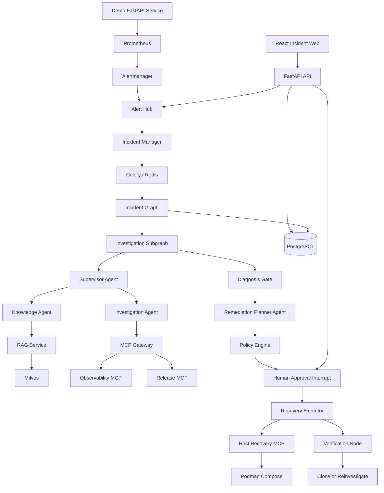

# Intelligent OnCall Agent V1 Design

**Date:** 2026-07-20

**Status:** Approved for implementation planning

**Project:** Software delivery intelligent OnCall agent

## 1. Objective

Build a local, enterprise-style intelligent OnCall system for software services. The first version demonstrates one complete incident lifecycle:

```text
faulty release
→ real monitoring alert
→ unified alert ingestion and deduplication
→ multi-agent investigation
→ SOP retrieval from Milvus
→ remediation planning
→ human approval
→ controlled rollback
→ recovery verification
→ incident resolution and audit timeline
```

The design prioritizes a working vertical slice over broad platform coverage. V1 targets one demo project and one fault family: a service release that increases HTTP errors.

## 2. Confirmed Product Decisions

- Backend: Python and FastAPI.
- Frontend: React and TypeScript.
- Agent framework: LangGraph with LangChain integrations.
- Model provider: Alibaba Cloud Bailian through an OpenAI-compatible API.
- Knowledge retrieval: Milvus hybrid dense and BM25 retrieval.
- Agent architecture: deterministic outer Incident Graph plus an investigation Supervisor and specialized subagents.
- Tool integration: narrow MCP servers behind an MCP Gateway.
- Runtime: Podman and `podman compose`; Docker Desktop and Docker CLI are not required.
- Recovery: a host-side Recovery MCP process performs a real, allowlisted Podman rollback.
- Authentication: local username/password authentication with JWT and RBAC.
- UI: incident list plus a tabbed incident detail page.
- V1 delivery priority: complete features first; comprehensive automated testing and agent evaluation are deferred to V1.1.
- V1 does not implement long-term memory or automated experience accumulation.

## 3. Scope

### 3.1 V1 includes

- A demo FastAPI service with a healthy `v1` release and a faulty `v2` release.
- A traffic generator that makes the release fault observable.
- Prometheus metrics and an Alertmanager `HighErrorRate` alert.
- An Alert Hub that accepts, validates, normalizes, deduplicates, and groups alerts.
- PostgreSQL-backed Incident lifecycle state and LangGraph checkpoints.
- A Supervisor that coordinates Investigation and Knowledge agents during investigation.
- A Remediation Planner Agent that runs only after the diagnosis gate.
- Manually authored, Git-versioned Skills.
- Manually imported Markdown SOP and Runbook documents in Milvus.
- Observability, Release, and Recovery MCP servers.
- A deterministic Policy Engine and Recovery Executor.
- Human approval before rollback.
- Deterministic recovery verification using service and Prometheus data.
- A React login page, incident list, incident detail tabs, approval controls, and admin user management.
- Structured audit events, JSON logs, and Prometheus application metrics.

### 3.2 V1 explicitly excludes

- User chat or conversational incident handling.
- Conversation memory, user preference memory, incident memory, or procedural memory.
- Automated extraction of experience from resolved incidents.
- Automated updates to SOPs, Runbooks, or Skills.
- Multiple tenants or multiple real application projects.
- Kubernetes.
- Kafka.
- Autonomous source-code changes.
- Unapproved production write actions.
- Multi-source semantic alert correlation.
- A browser-based knowledge upload and approval workflow.
- Comprehensive unit, integration, browser, RAG evaluation, and Agent evaluation suites.

### 3.3 Later versions

V1.1 adds automated tests, replay fixtures, RAG retrieval evaluation, Agent evaluation, MCP contract tests, and browser end-to-end tests.

V2 adds user conversation, short- and long-term memory, structured incident experience, deduplication and review of learned experience, and reviewed SOP or Skill evolution.

## 4. Architecture Alternatives and Decision

### 4.1 Alternative A: fully autonomous Supervisor

The Supervisor freely chooses agents, tools, approval, execution, and verification steps. This minimizes code but cannot reliably guarantee that investigation, approval, or verification occurs. It also makes checkpoint recovery and deterministic testing difficult.

### 4.2 Alternative B: deterministic lifecycle plus controlled Supervisor

The outer LangGraph controls the Incident lifecycle. A Supervisor dynamically coordinates read-only investigation inside a bounded subgraph. Planning, approval, execution, and verification are explicit nodes.

This is the selected design because it preserves flexible investigation while making side effects predictable, reviewable, interruptible, and auditable.

### 4.3 Alternative C: peer-to-peer or event-driven Agent swarm

Agents communicate directly or run as independently deployed services. This provides strong isolation and scale but introduces coordination loops, distributed state, and infrastructure that are unnecessary for one MVP incident flow.

## 5. System Architecture



The core OnCall backend is a modular monolith. MCP servers are separate processes with explicit tool contracts. The demo project is isolated from the OnCall platform except through alerts and MCP interfaces.

## 6. Component Responsibilities

### 6.1 FastAPI API

- Accept Alertmanager webhooks.
- Expose authentication, Incident, approval, retry, report, user administration, and SSE endpoints.
- Persist commands before queueing background work.
- Never run a long Agent investigation inside a request handler.

### 6.2 Alert Hub

- Authenticate the configured alert source.
- Preserve the raw webhook.
- Convert source payloads into `AlertEnvelope` objects.
- Calculate or validate fingerprints.
- Deduplicate repeated notifications.
- Apply deterministic correlation rules.
- Attach alerts to an existing open Incident or create a new Incident.
- Track `firing` and `resolved` alert states.

Alert normalization, identity, and basic grouping use deterministic code. These operations must be idempotent, low latency, replayable, and available even when the model provider is unavailable.

### 6.3 Incident Manager

- Own valid Incident state transitions.
- Associate alerts with Incidents.
- Create audit events.
- Submit idempotent start or resume jobs.
- Reject stale commands and invalid transitions.

### 6.4 Job Worker

- Consume Celery tasks from Redis.
- Start or resume LangGraph runs.
- Use PostgreSQL as the durable source of truth.
- Release the Worker when a Graph reaches an approval interrupt.

### 6.5 RAG Service

- Import approved Markdown SOP and Runbook files.
- Split by Markdown section and then by token size.
- Create dense and sparse representations.
- Apply project, service, document type, version, and review-status filters.
- Return bounded results with source paths and section citations.

### 6.6 Policy Engine

- Enforce environment and action allowlists.
- Validate ActionPlan hashes and approval state.
- Validate expected current release and allowed target release.
- Reject expired or stale plans.
- Assign explicit failure categories.

### 6.7 Recovery Executor

- Accept only approved structured `ActionSpec` values.
- Validate idempotency and preconditions.
- Call the Recovery MCP tool once.
- Record execution state before and after the call.
- Never generate new commands when execution fails.

## 7. Unified Alert Model

All source adapters produce an `AlertEnvelope` with these required concepts:

```json
{
  "source": "alertmanager",
  "project_id": "demo-shop",
  "environment": "staging",
  "service": "order-api",
  "alert_name": "HighErrorRate",
  "severity": "critical",
  "status": "firing",
  "starts_at": "2026-07-20T06:00:00Z",
  "fingerprint": "sha256:...",
  "labels": {},
  "annotations": {}
}
```

Fingerprint selection:

1. Use the source fingerprint when it is present and valid.
2. Otherwise hash `project_id`, `environment`, `service`, `alert_name`, and configured stable labels.
3. Repeated deliveries update `last_seen`, `status`, and `occurrence_count`; they do not create new alerts.

V1 Incident grouping requires the same project, environment, service, and configured correlation key inside a five-minute window. A resolved alert updates alert state but cannot bypass the Verification Node to close an Incident.

Future semantic correlation will use a hybrid approach: deterministic identity and candidate grouping remain mandatory; an LLM may recommend cross-service merges but cannot change fingerprints, delete alerts, or directly close Incidents.

## 8. Incident Graph and Multi-Agent Orchestration

The outer graph is deterministic:

```text
normalize_incident
→ investigate
→ diagnosis_gate
→ create_remediation_plan
→ evaluate_policy
→ wait_for_approval
→ execute_action
→ verify_recovery
→ close_or_reinvestigate
```

### 8.1 Supervisor Agent

- Operates only inside the Investigation Subgraph.
- Reviews compact Incident facts and evidence summaries.
- Chooses whether to call Investigation or Knowledge.
- Determines what evidence is still missing.
- Submits a diagnosis candidate to the Diagnosis Gate.
- Cannot call Recovery MCP or approve an ActionPlan.

### 8.2 Investigation Agent

- Uses read-only Observability and Release MCP tools.
- Produces observations, evidence, hypotheses, and suggested next checks.
- Stores references to raw data rather than large raw log bodies in Graph state.

### 8.3 Knowledge Agent

- Uses RAG retrieval tools only.
- Returns applicable steps, warnings, document versions, and citations.
- Cannot present an unapproved or expired document as authoritative guidance.

### 8.4 Remediation Planner Agent

- Runs only after the Diagnosis Gate accepts a diagnosis.
- Receives the selected hypothesis, supporting and opposing evidence, citations, current release, and environment.
- Produces a structured ActionPlan with preconditions, risk, rollback target, and verification criteria.
- Has no execution tools.

### 8.5 Investigation limits

- Maximum investigation rounds: 4.
- Maximum subagent calls per round: 2.
- Maximum log result size: 100 entries or 20 KB.
- Maximum RAG results: 5 chunks.
- Maximum model calls per Incident: 12.
- Investigation time budget: 5 minutes, excluding human approval wait.
- Maximum reinvestigation after failed verification: 1.

Exceeding a limit moves the Incident to `NEED_HUMAN` with an explicit reason.

## 9. Structured Contracts

Agent and Graph boundaries use Pydantic models rather than unconstrained text. The core contracts are:

- `AlertEnvelope`: normalized alert facts.
- `Evidence`: source type, source reference, query summary, observation, and collection time.
- `Hypothesis`: root-cause statement, confidence evidence, supporting evidence IDs, opposing evidence IDs, and next checks.
- `KnowledgeCitation`: document, version, section, source path, and excerpt reference.
- `ActionPlan`: summary, risk, preconditions, ordered actions, rollback behavior, and verification criteria.
- `ActionSpec`: tool name and validated tool-specific arguments.
- `VerificationResult`: checks, observations, outcome, and reason.

Model output that fails schema validation is retried once with validation feedback. A second failure stops automatic processing and requests human attention.

## 10. RAG Design

### 10.1 Alternatives

- Dense-only retrieval is simple but weak for exact error codes, service names, metric names, and versions.
- Dense plus BM25 retrieval covers semantic language and precise operational identifiers.
- Knowledge graph retrieval is useful for complex dependency reasoning but requires graph extraction and maintenance beyond V1.

V1 selects Milvus dense plus BM25 hybrid retrieval with reciprocal-rank fusion.

### 10.2 Document model

Each chunk includes:

```text
chunk_id
project_id
document_id
document_type
service
environment
title
section_path
content
source_path
version
review_status
dense_vector
sparse_vector
```

Only `review_status=approved` documents are returned. V1 supports Markdown knowledge files. Original documents and Skill packages remain in Git; Milvus is a retrieval index, not the authoritative document store.

Dense embeddings use the configured Bailian OpenAI-compatible embedding endpoint. The embedding model name is supplied through environment configuration so the ingestion and query paths always use the same model and vector dimension.

### 10.3 Ingestion

Knowledge ingestion is a CLI operation:

```bash
python -m oncall.cli knowledge ingest \
  --project demo-shop \
  --path project-packs/demo-shop/knowledge
```

V1 does not expose browser upload or automatic knowledge writes.

## 11. Skill Design

### 11.1 Alternatives

- Letting the Supervisor browse every Skill is flexible but causes context growth and poor selection as the registry grows.
- Deterministic one-to-one rules are reliable but cannot handle ambiguous fault families.
- Hybrid selection first filters candidates by metadata and then lets the Supervisor select among at most three candidates.

V1 selects hybrid Skill triggering.

### 11.2 Skill package

```text
skills/post_deployment_regression/
├── skill.yaml
├── instructions.md
└── examples/
    └── example.json
```

The manifest declares applicable alert names, service types, labels, permitted read-only tools, forbidden actions, expected output schema, and Skill version. Skills guide investigation and cannot bypass Policy or call Recovery MCP.

V1 Skills are manually authored and versioned in Git. Automatic Skill generation or mutation is a V2 feature.

## 12. MCP Design

### 12.1 Alternatives

- Direct SDK access from each Agent duplicates authentication, timeout, result-bounding, and audit logic.
- One large MCP server mixes read-only and write privileges.
- Multiple narrow MCP servers isolate privilege and backend ownership.

V1 uses multiple narrow servers behind an MCP Gateway. Containerized MCP servers use Streamable HTTP. The host Recovery MCP listens on loopback; the Worker addresses the macOS host through Podman's `host.containers.internal` gateway, which is resolved by the Podman Machine network. Startup readiness fails if the Worker cannot reach the Recovery MCP endpoint.

### 12.2 Observability MCP

```text
query_metrics
query_service_logs
get_service_health
get_active_alerts
```

### 12.3 Release MCP

```text
get_current_release
get_recent_releases
get_release_diff
```

### 12.4 Recovery MCP

```text
rollback_release
```

The Recovery tool accepts project, environment, service, expected current version, target version, approval proof, and idempotency key. It does not accept command strings, arbitrary paths, SQL, shell content, or raw Podman arguments.

The MCP Gateway enforces schemas, timeouts, result limits, service authentication, audit metadata, and error mapping.

## 13. Podman Runtime and Real Rollback

### 13.1 Alternatives

- Raw `podman run` scripts make multi-service lifecycle and networking difficult to maintain.
- Podman Quadlet is appropriate for long-lived Linux systemd deployment but awkward for macOS development.
- `podman compose` provides a readable local multi-container definition.

V1 uses `podman compose`, `compose.yaml`, and `Containerfile` files. It avoids Docker-exclusive Compose extensions.

The Podman-managed services include API, Worker, PostgreSQL, Redis, Milvus and its required standalone dependencies, Prometheus, Alertmanager, demo service, traffic generator, frontend, Observability MCP, and Release MCP.

### 13.2 Recovery process placement

Mounting the Podman socket into a container gives that container broad control of the environment. V1 therefore runs Recovery MCP as a host-side Python process.

The process:

1. Listens on `127.0.0.1`.
2. Validates a dedicated service secret.
3. Validates the project, service, current version, target version, plan hash, and idempotency key.
4. Updates only the controlled demo release state.
5. Invokes a fixed internal Podman argument list.
6. Records the result and exposes idempotent status lookup.

The LLM never provides command strings or Compose file paths.

## 14. Authentication and Authorization

### 14.1 Alternatives

- No authentication cannot produce trustworthy approval audit records.
- Keycloak/OIDC is closer to enterprise SSO but adds substantial V1 infrastructure.
- Local password authentication with JWT supports real user identity and RBAC while preserving an upgrade path to OIDC.

V1 uses local authentication.

### 14.2 Passwords and tokens

- Passwords use Argon2id hashes.
- Access JWT lifetime: 15 minutes.
- Access tokens remain in React memory.
- Refresh token lifetime: 7 days.
- Refresh tokens are random values stored in HttpOnly, SameSite cookies.
- PostgreSQL stores only refresh-token hashes.
- Refresh tokens rotate on use and are revoked on logout or user disablement.
- JWT signing uses HS256 with a random environment-provided secret because one API issues and verifies V1 tokens.

### 14.3 Roles

- `viewer`: read Incidents, evidence, plans, citations, reports, and audit events.
- `operator`: viewer permissions plus retry and reinvestigation commands.
- `approver`: viewer permissions plus approve or reject ActionPlans.
- `admin`: all web permissions plus user administration. Knowledge ingestion remains a host-side CLI operation in V1.

Approvals bind `user_id`, `action_plan_id`, `action_plan_hash`, decision, comment, and timestamp. Changing a plan invalidates its previous approvals.

V1 does not implement self-registration, email verification, password-reset email, MFA, or enterprise SSO. An initial administrator is created through a CLI command rather than a password embedded in Compose.

## 15. Persistence and Background Work

### 15.1 Alternatives

- Running a Graph inside the webhook request blocks alert delivery.
- FastAPI background tasks share the API process and do not provide durable retry.
- Celery plus Redis separates API and workers and provides bounded retry with modest infrastructure.
- Kafka is unnecessary for one source and one worker family.

V1 uses Celery and Redis. PostgreSQL remains the durable source of truth; Redis is a broker, short-lived lock store, and SSE event distribution mechanism.

Every start or resume job uses an idempotent key based on Incident, operation, and checkpoint version. A Graph interrupt persists its checkpoint and ends the Worker job. Approval creates a new resume job rather than holding a Worker during human wait.

### 15.2 PostgreSQL access

V1 uses SQLAlchemy 2-style models and Alembic migrations. Database models remain separate from Pydantic API and Agent contracts.

Core relational entities:

```text
users
refresh_tokens
raw_alert_events
alerts
incidents
incident_alerts
evidence
hypotheses
hypothesis_evidence
knowledge_citations
action_plans
action_steps
approvals
executions
verification_checks
audit_events
LangGraph checkpoint tables
```

Runtime data is not a memory system and is not automatically reused as learned experience in another Incident.

## 16. API Surface

Authentication:

```text
POST /api/v1/auth/login
POST /api/v1/auth/refresh
POST /api/v1/auth/logout
GET  /api/v1/auth/me
```

Alert ingestion:

```text
POST /api/v1/webhooks/alertmanager/{project_id}
```

Incident operations:

```text
GET  /api/v1/incidents
GET  /api/v1/incidents/{incident_id}
GET  /api/v1/incidents/{incident_id}/events
GET  /api/v1/incidents/{incident_id}/stream
POST /api/v1/incidents/{incident_id}/approvals
POST /api/v1/incidents/{incident_id}/rejections
POST /api/v1/incidents/{incident_id}/retries
GET  /api/v1/incidents/{incident_id}/report
```

Administration:

```text
GET   /api/v1/admin/users
POST  /api/v1/admin/users
PATCH /api/v1/admin/users/{user_id}
```

## 17. Frontend Design

V1 uses separate list and detail pages instead of a dense three-column command center or a chat-first UI.

Routes:

```text
/login
/incidents
/incidents/:incidentId
/admin/users
```

Incident detail tabs:

- Overview: state, severity, service, environment, alert summary, and diagnosis.
- Timeline: alert, Agent, tool, approval, execution, and verification events.
- Evidence: metrics, logs, release facts, and source references.
- Knowledge: SOP and Runbook citations with version and section.
- Remediation: plan, risk, preconditions, target version, verification criteria, and approve/reject controls.
- Audit: actor, action, result, correlation IDs, and timestamps.

Commands use REST. Live Incident updates use SSE because updates are predominantly server-to-browser. SSE reconnection uses event IDs. Chat and bidirectional realtime messaging are deferred to V2.

Redis notifies connected API instances about new events, but replay comes from PostgreSQL `audit_events`. A reconnecting client sends its last event ID and receives any missed durable events before resuming the live stream.

## 18. Safety and Failure Handling

### 18.1 Failure categories

- `RETRYABLE`: transient Bailian errors, read-only MCP timeouts, and transient database failures.
- `NEED_HUMAN`: insufficient evidence, missing knowledge, stale preconditions, unknown write outcome, or failed verification.
- `TERMINAL`: invalid parameters, authorization failure, invalid approval, plan hash mismatch, forbidden action, or schema-invalid tool result.

Read-only transient calls use exponential backoff with jitter and at most two retries. Write calls are never blindly retried. An unknown write result is reconciled through its idempotency key before another decision.

### 18.2 Execution gates

Before rollback, the Executor validates:

```text
action allowlist
→ environment policy
→ ActionPlan hash
→ approver role and approval validity
→ expected current release
→ target release allowlist
→ concurrent release absence
→ idempotency state
```

Failure stops execution and records an audit event. The Executor cannot ask an LLM to invent a new operation.

### 18.3 Untrusted content

Alert annotations, logs, MCP results, and document content are untrusted data. They cannot change system instructions, tool permissions, project scope, approval requirements, or action allowlists. Sensitive values are redacted before model submission. Raw large logs remain in the source system; Graph state stores bounded summaries and references.

## 19. Observability

V1 requires:

- JSON structured logs.
- `incident_id`, `graph_run_id`, `agent_name`, `tool_call_id`, and `job_id` correlation fields.
- Prometheus application metrics.
- Database-backed `audit_events` as the UI timeline source.

Optional LangSmith tracing may be enabled for development but is not required for system operation.

Core metrics include received and deduplicated alerts, created Incidents, Agent run duration, model calls, MCP call duration, approval wait, recovery executions, and verification failures.

## 20. Feature-First Verification

Comprehensive automated testing is intentionally deferred to V1.1. V1 completion is demonstrated by a manual end-to-end acceptance run:

1. Start the Podman environment.
2. Create and log in as a valid user.
3. Start healthy demo release `v1`.
4. Deploy faulty release `v2`.
5. Confirm traffic produces a Prometheus error-rate alert.
6. Confirm Alert Hub preserves, normalizes, and deduplicates the alert.
7. Confirm one Incident is created.
8. Confirm Supervisor coordinates Investigation and Knowledge.
9. Confirm MCP supplies metrics, logs, and release facts.
10. Confirm Milvus returns the approved post-deployment regression SOP with citations.
11. Confirm Remediation Planner produces a rollback ActionPlan.
12. Confirm the Graph stops at human approval and no rollback has occurred.
13. Log in as an `approver` and approve the exact plan hash.
14. Confirm Recovery Executor calls the host Recovery MCP once.
15. Confirm the demo service returns to `v1`.
16. Confirm Verification observes recovered metrics.
17. Confirm the Incident reaches `RESOLVED` and the UI timeline is complete.

## 21. Architecture Decision Summary

| Area | Selected approach | Primary reason |
|---|---|---|
| Incident orchestration | Deterministic Graph + controlled Supervisor | Flexible investigation with predictable side effects |
| Alert identity and basic grouping | Deterministic rules | Idempotency, availability, auditability |
| Retrieval | Milvus dense + BM25 | Semantic text plus exact operational identifiers |
| Skill trigger | Rule-filtered candidates + Supervisor choice | Bounded context with semantic flexibility |
| Tool integration | Multiple narrow MCP servers | Privilege isolation and stable contracts |
| Recovery | Deterministic Executor + host Recovery MCP | Real rollback without exposing Podman socket to an Agent container |
| Container runtime | Podman Compose | Local multi-container readability and Podman-only environment |
| Background jobs | Celery + Redis | Durable separation of web requests and Agent runs without Kafka |
| Database | PostgreSQL + SQLAlchemy + Alembic | Transactions, relationships, migrations, auditability |
| Authentication | Local password + JWT + RBAC | Real approval identity without Keycloak overhead |
| Realtime UI | REST commands + SSE updates | Predominantly one-way Incident events |
| Memory | None in V1 | Keep the first release focused on the operational loop |
| Quality strategy | Manual acceptance in V1 | Feature-first delivery; automated quality system moves to V1.1 |
